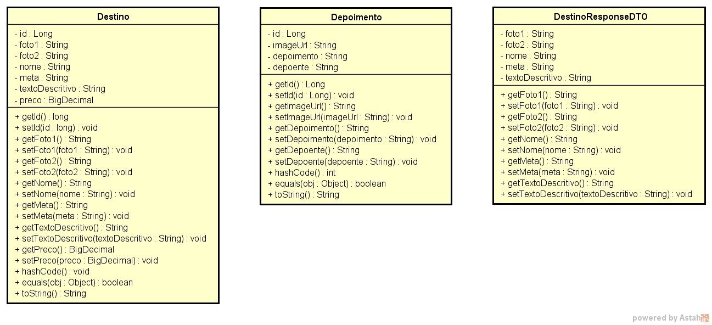
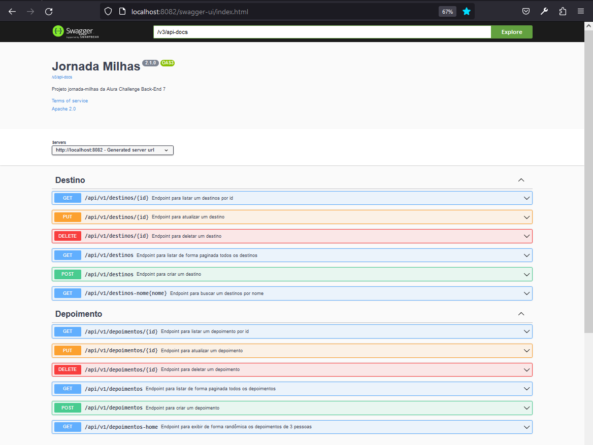

# Alura Challenge Back-End 7

## Descrição

Este é um projeto desenvolvido durante o Alura Challenge Backend 7ª edição. O projeto consiste no desenvolvimento de uma API que será integrada ao frontend. O objetivo é disponibilizar informações e recursos do banco de dados relacionados a possíveis destinos de viagem, exibindo fotos e um texto chamativo que instigue o usuário a querer visitar aquele destino.

## Requisitos

Os requisitos foram definidos e disponibilizados utilizando a ferramenta Trello.

* Semana 1
  * CRUD de Depoimentos
  * Endpoint de depoimento
  * Configurar o CORS
  * Testes
* Semana 2
  * CRUD de Destinos
  * Endpoint de busca de destinos
  * Teste
* Semana 3
  * Nova versão de Destino
  * Endpoint de destinos pelo ID

## Diagrama de classes



### Tecnologias utilizadas

| Tecnologia         | Versão  |
| ------------------ | ------- |
| Java               | 17      |
| Spring             | 3.1.1   |
| H2 Database        | 2.1.214 |
| Springdoc Open API | 2.1.0   |
| MySQL Database     | 8.0.31  |
| Docker             | 4.21.1  |

## Profiles

Para esta aplicação foram criados dois perfis:
* test - para subir a aplicação em memória utilizando o H2
* dev - para subir a aplicação em container utilizando Docker


## Docker Compose

```bash
# sobe o container
docker-compose -f docker-compose-dev.yml up --build -d

# remove o container
docker-compose -f docker-compose-dev.yml down
```

## Endpoints

#### Depoimentos
| Método HTTP | Prefixo | Endpoint          | Descrição                                 |
| ----------- | ------- | ----------------- | ----------------------------------------- |
| GET         | /api/v1 | /depoimentos      | Retorna uma lista paginada de depoimentos |
| GET         | /api/v1 | /depoimentos/1    | Retorna o depoimento com o id 1           |
| POST        | /api/v1 | /depoimentos      | Cria um depoimento                        |
| PUT         | /api/v1 | /depoimentos/1    | Atualiza o depoimento com o id 1          |
| DELETE      | /api/v1 | /depoimentos/1    | Remove o depoimento com o id 1            |
| GET         | /api/v1 | /depoimentos-home | Remove 3 depoimentos de forma randômica   |

#### Destinos
| Método HTTP | Prefixo | Endpoint                  | Descrição                                             |
| ----------- | ------- | ------------------------- | ----------------------------------------------------- |
| GET         | /api/v1 | /destinos                 | Retorna uma lista paginada de destinos                |
| GET         | /api/v1 | /destinos/1               | Retorna o destino com o id 1                          |
| POST        | /api/v1 | /destinos                 | Cria um destino                                       |
| PUT         | /api/v1 | /destinos/1               | Atualiza o destino com o id 1                         |
| DELETE      | /api/v1 | /destinos/1               | Remove o destino com o id 1                           |
| GET         | /api/v1 | /destinos-nome?nome=Paris | Retorna uma lista de destinos contendo a string Paris |

Documentação interativa com o Swagger:
No browser acesse http://localhost:8082/swagger-ui/index.html



## Licença 

The [MIT License]() (MIT)
Copyright :copyright: 2023 - jornada-milhas